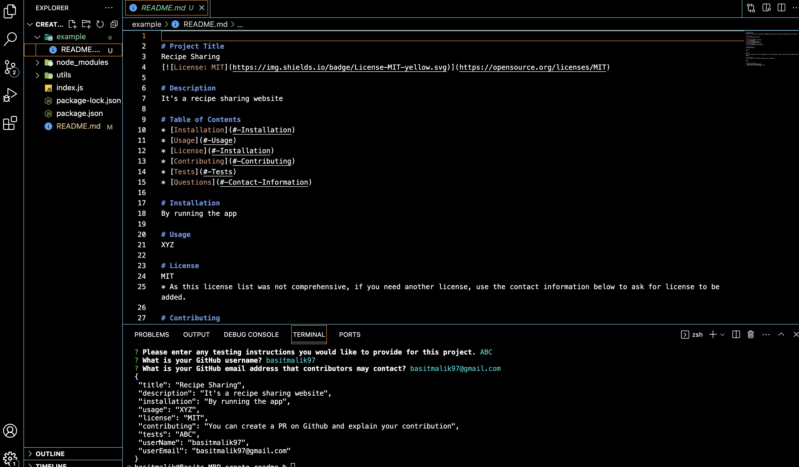

# README Generator: Node.js and ES6+ Work

When initiating an open-source project on GitHub, it becomes imperative to craft an exemplary README. This README should encompass essential information regarding the application's purpose, usage guidelines, installation procedures, issue reporting, and avenues for contributing. Employing a command-line application streamlines the creation of such project READMEs, expediting project initiation. This approach empowers project creators to allocate more time to project development and less to README composition.

I've developed a command-line application that dynamically assembles a polished README.md based on user input. This application leverages the Inquirer package. To employ the application, simply execute the following command:

```
node index.js
```

Because this is a command-line application won’t be deployed, here is a <a href="https://drive.google.com/file/d/1VWWWcUwy8Li_TuWUN21cfA7TWxyq-Opn/view?usp=sharing" target="_blank">Link</a> to a video walkthrough that demonstrates the functionality of my application.

## Application Running in Command Line
The following picture shows the command line functionality of the program:



## User Story

```
AS A developer
I WANT a README generator
SO THAT can quickly create a professional README for a new project
```

## Acceptance Criteria

```md
GIVEN a command-line application that accepts user input
WHEN I am prompted for information about my application repository
THEN a quality, professional README.md is generated with the title of your project and sections entitled Description, Table of Contents, Installation, Usage, License, Contributing, Tests, and Questions
WHEN I enter my project title
THEN this is displayed as the title of the README
WHEN I enter a description, installation instructions, usage information, contribution guidelines, and test instructions
THEN this information is added to the sections of the README entitled Description, Installation, Usage, Contributing, and Tests
WHEN I choose a license for my application from a list of options
THEN a badge for that license is added hear the top of the README and a notice is added to the section of the README entitled License that explains which license the application is covered under
WHEN I enter my GitHub username
THEN this is added to the section of the README entitled Questions, with a link to my GitHub profile
WHEN I enter my email address
THEN this is added to the section of the README entitled Questions, with instructions on how to reach me with additional questions
WHEN I click on the links in the Table of Contents
THEN I am taken to the corresponding section of the README
```

## Application Requirements

* Functional application.

* Here is my <a href="https://github.com/basitmalik97/create-readme" target="_blank">GitHub Repo Link</a>.

## The generated README includes the following sections: 

  * Title
  * Description
  * Table of Contents
  * Installation
  * Usage
  * License
  * Contributing
  * Tests
  * Questions


## Environment
* JavaScript
* Node.js


